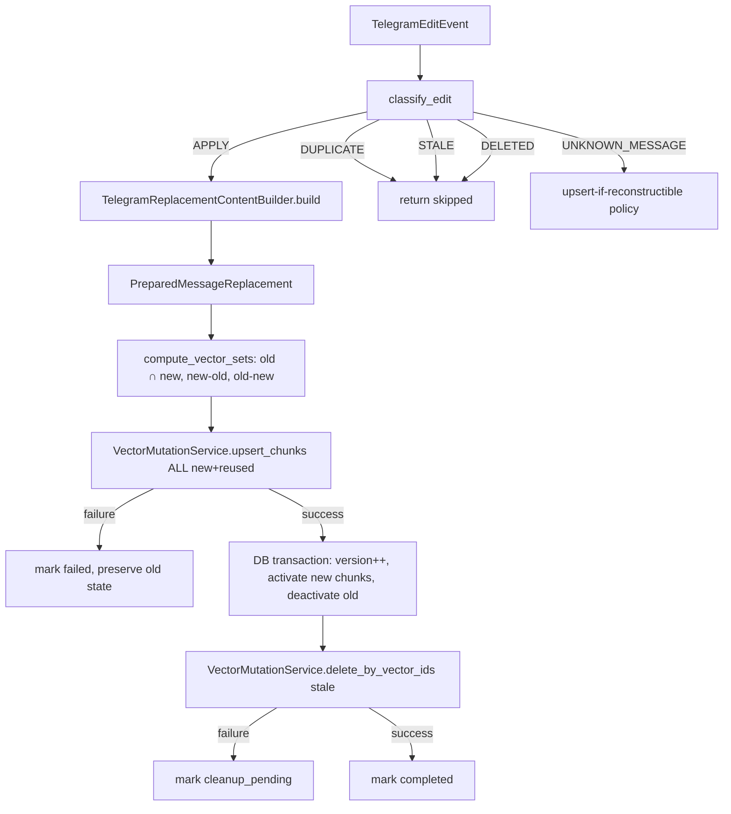

# Design — Telegram Multi-Chunk Edit Handling

## Overview

Generalizes `TelegramEditSynchronizationService` (currently text-only, 1 vector)
to handle all content types with N vectors each, using proper set-diffing and
failure-safe Strategy C replacement. All new components are [ADDITIVE] on top
of the existing text-edit path, which becomes one content-type case of the
general mechanism.

## Decision Records

**DR-M1 (Phase 1) — Edit Ordering Signal**
Primary: internal `message_version` + `edit_timestamp` (stored on message record).
Tie-break: if edit_timestamps are equal, `update_id` string comparison (higher = newer).
Reason: Telegram's `edit_date` is reliable for most cases; `update_id` breaks ties
from rapid re-edits. Internal version is authoritative for idempotency.
Rollback: change `classify_edit()` to use a different tie-break; no DB schema change.

**DR-M2 (Phase 5) — Version NOT in Vector ID**
`message_version` is stored in vector metadata only, NOT embedded in the vector ID.
Format remains: `telegram:{account}:{conv}:{msg}:{content_part}:{chunk_index}`
Reason: stable IDs allow upsert-in-place for reused chunks, which is the core
efficiency of Strategy C. Including version would make every chunk "new" on every edit.
Tradeoff: stale detection is done by set difference of old vs new IDs, not version prefix.
Rollback: no schema change; if version-in-ID is later required, add a new ID scheme.

**DR-M3 (Phase 6) — Strategy C confirmed for multi-chunk**
Prior DR-3 (Strategy C: upsert then delete stale) confirmed and unchanged for multi-chunk.
Multi-chunk makes Strategy A (delete-before-publish) riskier (larger deletion window)
and Strategy B (version metadata filter) more complex (all retrieval queries need filter).
Strategy C's set-difference approach scales naturally to N chunks.
Cite: Prior milestone DR-3.

**DR-M4 (Phase 10) — Caption-only reuse criteria**
Reuse criteria: checksum AND telegram_file_id both unchanged.
If checksum matches but telegram_file_id differs → re-process (new file, same content is coincidental).
If telegram_file_id matches but no checksum → re-process (checksum unavailable = can't confirm).
Only when both match: reuse existing extracted text and regenerate embeddings from new caption + existing text.
Reason: telegram_file_id alone is not sufficient (Telegram can reassign IDs); checksum alone
is not sufficient (different file, same hash collision — rare but possible for safety-critical reuse).

## Architecture

## Key Components

### New: `classify_edit()` function
Location: `app/integrations/telegram/services/edit_classifier.py`
Pure function, no DB/IO. Returns `EditDecision` enum.

### New: `TelegramReplacementContentBuilder`
Location: `app/integrations/telegram/services/replacement_builder.py`
Pure planning service. No DB writes. Returns `PreparedMessageReplacement`.

### New: `PreparedVectorChunk` / `PreparedMessageReplacement`
Location: same file or `app/integrations/telegram/services/edit_models.py`
Pure data models.

### Modified: `TelegramEditSynchronizationService`
[REFACTOR-SAFE] generalizes from hardcoded text:0 → uses builder for all types.
Contract snapshot test ensures text-edit behavior is unchanged.

### Modified: `EditSyncResult`
[ADDITIVE] new fields: old_chunk_count, replacement_chunk_count, reused_vector_count,
inserted_vector_count, updated_vector_count, reconciliation_required, duplicate, stale.
Existing fields preserved unchanged.

### Modified: `TelegramSynchronizationReconciler`
[REFACTOR-SAFE] adds detection of edit-specific partial states.

## Vector ID Scheme (stable, DR-M2)

`telegram:{source_account_id}:{conversation_id}:{source_message_id}:{content_part}:{chunk_index}`

Examples:
- `telegram:acc1:chat1:msg1:text:0`
- `telegram:acc1:chat1:msg1:pdf:0` .. `pdf:4`
- `telegram:acc1:chat1:msg1:voice:0` .. `voice:2`

## Metadata per chunk (scalar, ChromaDB-compatible)

All existing VectorMetadata fields + `message_version: int` (in `extra` dict).

## Files to Modify

1. `app/integrations/telegram/services/edit_sync.py` — generalize [REFACTOR-SAFE]
2. `app/integrations/telegram/services/reconciliation.py` — extend [REFACTOR-SAFE]
3. `api/routes/telegram.py` — EditSyncResult fields [ADDITIVE]

## Files to Create

1. `app/integrations/telegram/services/edit_classifier.py`
2. `app/integrations/telegram/services/replacement_builder.py`
3. `tests/test_multichunk_edit.py`
