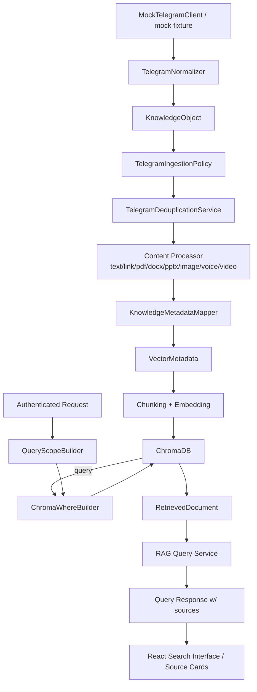

# Design — Telegram Vector Metadata & Retrieval

## Overview

Extends Nexora's existing Telegram ingestion pipeline so that identity metadata
survives end-to-end into ChromaDB and back out through retrieval, with owner
isolation enforced server-side. Introduces exactly four new/extended components
and reuses everything else already in the repository.

**Constraint:** No new vector store, embedding model, or query engine.
Live TDLib, edit/delete sync, and encryption are excluded.

---

## Architecture



---

## Existing Components (confirmed against real repo — extend, do not duplicate)

| Component | File | Role |
|---|---|---|
| KnowledgeObject | `models/knowledge_object.py` | Source-independent domain model |
| TelegramNormalizer | `app/integrations/telegram/mapping/telegram_normalizer.py` | Event → KnowledgeObject |
| TelegramIngestionPolicy | `app/integrations/telegram/services/ingestion_policy.py` | Future-message gating |
| TelegramDeduplicationService | `app/integrations/telegram/services/deduplication_service.py` | Stable vector IDs |
| MetadataFilter (existing) | `app/retrieval/metadata_filter.py` | Filter allowlist + ChromaDB where |
| SimilaritySearch | `app/retrieval/similarity_search.py` | Executes ChromaDB query |
| RetrievedDocument | `models/retrieved_document.py` | Query result model |
| query_service | `api/services/query_service.py` | Orchestrates Phase 5+6 |
| QueryResponse schema | `api/schemas/response_models.py` | API response shape |

---

## Four New / Extended Components

### 1. VectorMetadata (canonical metadata model)

**Location:** `models/vector_metadata.py` (new file — no equivalent exists)

Pydantic model with all fields from Requirement 1, plus
`to_vector_store_metadata() -> dict[str, str | int | float | bool]` performing
all scalar coercion (datetime → ISO-8601 string, enum → str value,
None → consistent default per type).

```python
class VectorMetadata(BaseModel):
    owner_id: str
    source: str
    source_account_id: str = ""
    conversation_id: str = ""
    conversation_title: str = ""
    conversation_type: str = ""
    sender_id: str = ""
    sender_name: str = ""
    source_message_id: str = ""
    content_type: str
    timestamp: datetime | None = None
    filename: str = ""
    mime_type: str = ""
    attachment_id: str = ""
    reply_to_message_id: str = ""
    chunk_index: int = 0
    is_edited: bool = False
    is_deleted: bool = False
    extra: dict[str, str | int | float | bool] = Field(default_factory=dict)

    def to_vector_store_metadata(self) -> dict[str, str | int | float | bool]:
        ...  # scalar coercion here
```

### 2. KnowledgeMetadataMapper (authoritative mapping boundary)

**Location:** `app/integrations/telegram/mapping/knowledge_metadata_mapper.py`

The single place that knows both the source-independent KnowledgeObject shape
and the Telegram-specific optional fields. Content processors and chunkers never
see Telegram event shapes directly.

```python
class KnowledgeMetadataMapper:
    def map(
        self,
        obj: KnowledgeObject,
        chunk_index: int = 0,
        content_part: str = "text",
        extra: dict | None = None,
    ) -> VectorMetadata:
        ...
```

### 3. QueryScopeBuilder (server-enforced owner isolation)

**Location:** `app/retrieval/query_scope_builder.py`

Forces `effective.owner_id = authenticated_owner_id` unconditionally; validates
requested conversation_id(s) belong to that owner before the filter reaches
ChromaDB.

```python
class QueryScopeBuilder:
    def build(
        self,
        authenticated_owner_id: str,
        requested_filters: TelegramMetadataFilter,
    ) -> EffectiveMetadataFilter:
        ...
```

### 4. ChromaWhereBuilder (single filter-construction point)

**Location:** `app/retrieval/chroma_where_builder.py`

Single controlled translation from `EffectiveMetadataFilter` to the ChromaDB
where-clause syntax actually supported by the installed version. Only this
component constructs raw ChromaDB filter dicts.

```python
class ChromaWhereBuilder:
    def build(self, filters: EffectiveMetadataFilter) -> dict[str, object]:
        ...
```

---

## Extended Existing Models

### MetadataFilter extension

Extend `app/retrieval/metadata_filter.py` with new Telegram fields while
preserving all existing fields intact. Or introduce `TelegramMetadataFilter`
as an extension of the existing model, depending on what `metadata_filter.py`
currently looks like after audit.

New fields: `owner_id`, `source`, `source_account_id`, `conversation_id`,
`conversation_ids`, `sender_id`, `content_type`, `content_types`,
`source_message_id`, `timestamp_from`, `timestamp_to`.

### RetrievedDocument extension

Extend `models/retrieved_document.py` with optional Telegram fields:
`owner_id`, `source`, `source_account_id`, `conversation_id`,
`conversation_title`, `conversation_type`, `sender_id`, `sender_name`,
`source_message_id`, `content_type`, `timestamp`, `filename`, `mime_type`.
All optional with `None` defaults.

### Query response schema extension

Extend `api/schemas/response_models.py` `QueryResponse` with a `sources` array
per Requirement 12. New `TelegramSourceResponse` Pydantic model covers all
required source fields.

---

## ChromaDB Version Verification (Requirement 7)

Before writing filter code, verify the installed ChromaDB version and its
supported `where` filter syntax. The `$in` operator (for multi-conversation
queries) may not exist in older versions — fall back to `$or` if not supported.
Timestamp range filtering reliability must be verified empirically; application-
level post-filter is the safe fallback.

---

## Vector ID Scheme (Requirement 4)

```
telegram:{source_account_id}:{conversation_id}:{source_message_id}:{content_part}:{chunk_index}

Examples:
  telegram:tg_account_001:tg_chat_anu_001:tg_message_1001:text:0
  telegram:tg_account_001:tg_chat_anu_001:tg_message_1001:pdf:0
  telegram:tg_account_001:tg_chat_anu_001:tg_message_1001:pdf:1
```

This scheme is already implemented in `KnowledgeObject.vector_document_id()` and
`TelegramDeduplicationService.vector_id()`. Wire it through the new
`KnowledgeMetadataMapper` so the mapper is the single point of ID generation.

---

## Error Handling

| Condition | Error type | HTTP surface |
|---|---|---|
| Client-supplied owner_id mismatch | `UnauthorizedOwnerScope` | 403, no internal detail |
| Unknown/unauthorized conversation_id | `ConversationNotFound` / `ConversationNotOwned` | 404/403 |
| Invalid sender for selected conversation | `InvalidSenderFilter` | 400 |
| Unsupported filter combination | `UnsupportedFilterCombination` | 400 |
| Malformed timestamp | `InvalidTimestampFilter` | 400 |
| ChromaDB filter build failure | `VectorFilterBuildError` | 500, generic, detail logged |
| Missing mandatory metadata at write | `MissingMandatoryMetadata` | 500, logged with IDs only |

No error response includes raw ChromaDB queries, DB paths, Telegram session
data, or stack traces.

---

## Testing Strategy

**Unit tests:**
- VectorMetadata coercion rules (every field type)
- KnowledgeMetadataMapper field mapping (text, PDF, DOCX, PPTX, image, voice, video)
- ChromaWhereBuilder output shape per scenario
- QueryScopeBuilder owner enforcement

**Integration tests (real test vector store):**
All 12 isolation scenarios from Requirement 16, against actual ChromaDB
test instance backed by `tmp_path`, using fixtures from Requirement 15.

**Regression:**
Full existing backend suite + frontend typecheck + frontend build vs. baseline
(523 passed / 2 known failures / 87 Telegram tests). Zero new failures.

**Non-goal check:**
Explicit assertion that `TDLibTelegramClient` is never instantiated in any
test or production code path added by this milestone.

---

## Data-Flow Audit Findings (Requirement 0)

To be completed as Task 1 against the actual repository before any code is
written. The audit will trace each step and record metadata loss points.

Known pre-audit observations:
- `TelegramNormalizer` → `KnowledgeObject`: identity fields are populated
- `KnowledgeObject` → ChromaDB: **no KnowledgeMetadataMapper exists yet** —
  this is the primary gap
- `MetadataFilter`: existing allowlist does not include Telegram identity fields
- `RetrievedDocument`: already has some Phase 5B fields; missing Telegram fields
- `query_service.py`: uses `score_threshold=0.0`; no owner enforcement today

Changes that could affect non-Telegram ingestion:
- Extending `MetadataFilter` allowlist: additive only, existing filter keys
  remain valid
- Extending `RetrievedDocument`: all new fields are Optional with None defaults
- Extending `QueryResponse`: `sources` field is new optional array, no existing
  field renamed or removed
