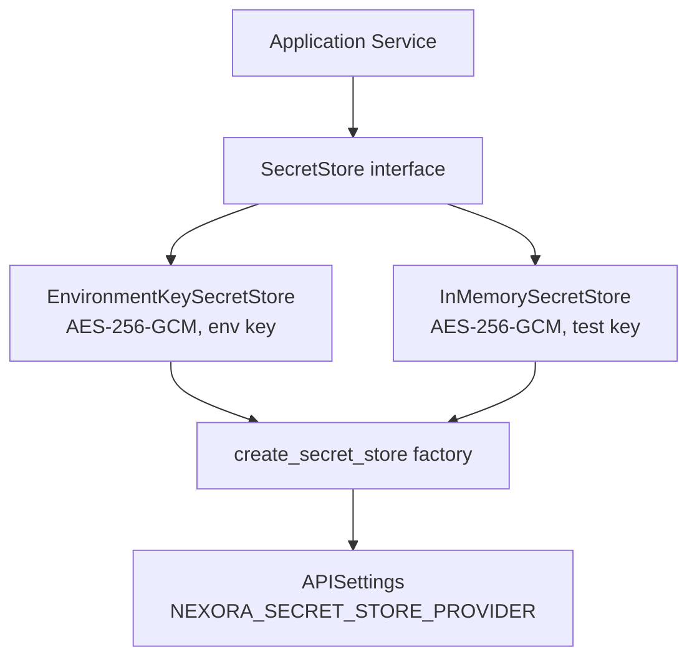

# Nexora Secret Storage — Part 2A

## Overview

Nexora's generic secret-storage layer provides authenticated encryption for
sensitive values (currently deferred to Part 2B: Telegram phone numbers and
session references). This document covers the abstract design, algorithm
choice, payload format, and operational guidance.

## Decision Records

All DR numbers below are authoritative — Part 2B depends on them.

### DR-S1 — Algorithm: AES-256-GCM

**Chosen:** AES-256-GCM via `cryptography` (PyCA) v46.0.5+.
**Key size:** 256 bits (32 bytes). **Nonce:** 96 bits (12 bytes), random per encryption.
**Auth tag:** 128 bits (AESGCM library default).
**Why:** Industry-standard AEAD, hardware-accelerated, mature library already installed.
**Migration impact:** Once Part 2B encrypts real phone numbers, changing the algorithm requires re-encrypting every stored ciphertext. This decision closes after Part 2B ships.
**Rollback (before Part 2B):** Delete `app/security/` entirely — no migration needed.

### DR-S2 — Startup failure mode: FAIL-FAST

**Chosen:** `SecretStoreConfigurationError` raised at service construction.
**Why:** Silent degraded mode risks storing plaintext secrets.

### DR-S3 — Multi-key-id support: YES

**Chosen:** Payload includes `key_id`; decryption looks up key by ID.
Today: one key. Future rotation: add second key to registry. No payload format change needed.

### DR-S4 — Context (AAD): optional, strict matching

Truth table:
| Encrypted with | Decrypted with | Result |
|---|---|---|
| no context | no context | ✅ success |
| no context | context="x" | ❌ integrity failure |
| context="x" | no context | ❌ integrity failure |
| context="x" | context="x" | ✅ success |
| context="x" | context="y" | ❌ integrity failure |

### DR-S5 — InMemorySecretStore: Option A (real encryption)

Tests use the same AES-256-GCM code path as production. Test key is `b"\x00" * 32` (documented as non-production).

### DR-S6 — Empty plaintext: REJECT

`SecretEncryptionError` raised for empty or whitespace-only plaintext.

## Architecture



## Payload Format

Wire format: `nexora:v1:<base64url(json)>`

JSON fields:
```json
{
  "version": "v1",
  "algorithm": "AES-256-GCM",
  "key_id": "dev-key-1",
  "nonce": "<base64url 12 bytes>",
  "ciphertext": "<base64url ciphertext+tag>"
}
```

## Configuration

```bash
# Generate a key:
python -m app.security.secrets.generate_key

# .env:
NEXORA_SECRET_STORE_PROVIDER=environment
NEXORA_SECRET_ENCRYPTION_KEY=<output from generator>
NEXORA_SECRET_KEY_ID=prod-key-1
NEXORA_SECRET_ENCRYPTION_VERSION=v1
```

**NEVER commit the key to source control. Losing it means encrypted secrets cannot be recovered.**

## Python Memory Limitations

Python immutable strings cannot be reliably zeroized. The secret store minimizes plaintext lifetime by working with bytes internally and avoiding unnecessary copies, but **does not guarantee secure memory erasure**. This is a documented limitation of Python-based secret handling.

## Future Integration (Part 2B)

Part 2B will encrypt Telegram phone numbers:
```python
store.encrypt(phone_number, context="telegram_phone_number")
```
And session references:
```python
store.encrypt(session_ref, context="telegram_session_reference")
```

## Key Rotation Plan (Part 2D)

1. Generate new key, assign new key_id.
2. Add to `extra_keys` registry in `EnvironmentKeySecretStore`.
3. New encryptions use new key_id; old decryptions still work.
4. Background job re-encrypts stored values under new key_id.
5. Remove old key from registry after all values migrated.
