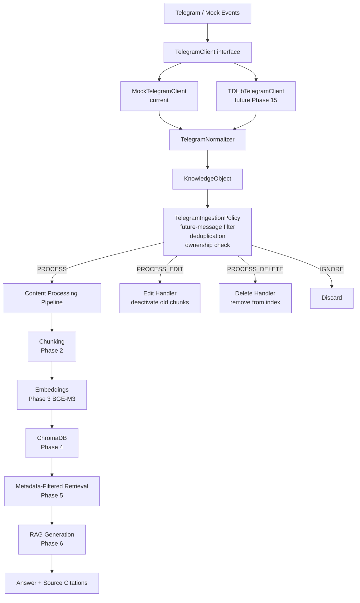

# Nexora Telegram Architecture

## Overview

Nexora is a private Telegram knowledge assistant. It connects to a user's
Telegram account through the Telegram Client API (TDLib), observes selected
future messages, processes text and supported media, stores them
conversation-wise, and enables contact-filtered Retrieval-Augmented Generation.

## Why TDLib, Not the Bot API

The **Telegram Bot API** requires the other party to message your bot — it
cannot observe existing private conversations or groups that haven't added
the bot. It is fundamentally unsuitable for a personal knowledge assistant.

The **Telegram Client API (TDLib)** authenticates as the actual user account
and can observe all conversations the user participates in, with explicit
per-chat consent enforced at the application layer. This is the correct
interface for a private knowledge assistant.

## Current Stage: Mock Client

Live TDLib is not yet integrated. The current implementation uses
`MockTelegramClient`, which replays fixture events from
`tests/fixtures/telegram/`. The complete processing pipeline — normalizer,
ingestion policy, deduplication, embedding, storage, retrieval, and RAG —
works end-to-end with mock data. Switching to live TDLib requires only a
config change (`NEXORA_TELEGRAM_CLIENT=tdlib`).

## Architecture Flow

## Component Map

| Component | Location | Status |
|---|---|---|
| TelegramClient interface | `app/integrations/telegram/client/base_telegram_client.py` | ✅ Done |
| MockTelegramClient | `app/integrations/telegram/client/mock_telegram_client.py` | ✅ Active |
| TDLibTelegramClient | `app/integrations/telegram/client/tdlib_client.py` | 🔲 Stub |
| TelegramNormalizer | `app/integrations/telegram/mapping/telegram_normalizer.py` | ✅ Done |
| ContentTypeMapper | `app/integrations/telegram/mapping/content_type_mapper.py` | ✅ Done |
| SenderResolver | `app/integrations/telegram/mapping/sender_resolver.py` | ✅ Done |
| TelegramIngestionPolicy | `app/integrations/telegram/services/ingestion_policy.py` | ✅ Done |
| TelegramDeduplicationService | `app/integrations/telegram/services/deduplication_service.py` | ✅ Done |
| Telegram DB Models | `app/integrations/telegram/models/telegram_models.py` | ✅ Done |
| KnowledgeObject | `models/knowledge_object.py` | ✅ Done |
| Telegram API routes | `api/routes/telegram.py` | ✅ Done |
| Mock event fixtures | `tests/fixtures/telegram/` | ✅ Done |
| Frontend pages | `frontend/src/features/telegram/` | ✅ Done |
| Legacy WhatsApp isolation | `app/integrations/legacy_whatsapp_import/` | 🔲 Phase 17 |

## Security Boundaries

- `owner_id` is always required and is the primary security filter on every retrieval query.
- Phone numbers are encrypted at rest; never stored in plaintext.
- OTP codes and 2FA passwords are never persisted after their auth call.
- Session references are opaque strings — no session secrets in application state.
- Per-chat indexing consent is explicit; only future messages are indexed.
- Deleted content is removed from the vector index and is no longer retrievable.
