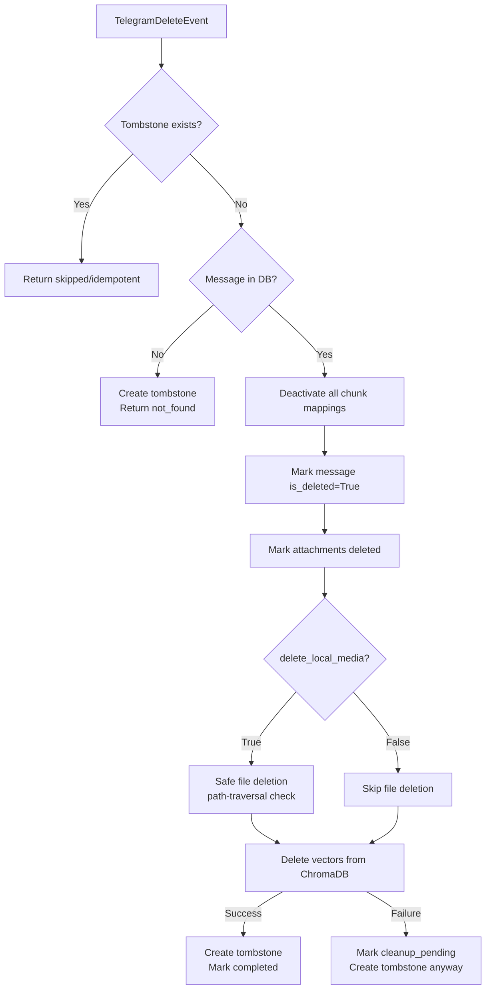

# Nexora Telegram Delete Synchronization

## Decision Record DR-5: Local Media Deletion Default

**Chosen:** `delete_local_media_on_source_delete = False` (default).

**Why:** Privacy-preserving default. A user may want to keep downloaded
documents even if the Telegram message is deleted. Accidental deletion of
local files is unrecoverable.

**How to change:** Set `NEXORA_DELETE_LOCAL_MEDIA_ON_DELETE=true` in environment.

## Delete Flow



## Tombstone Replay Protection

Once a tombstone exists for `(source_account_id, conversation_id, source_message_id)`,
any future edit or new-message event for that identity is rejected with
`status=skipped, reason=tombstone_exists`. This prevents replayed events from
restoring deleted content after a reconnection.

## File Deletion Safety

`_safe_delete_file()` resolves the path against `NEXORA_MEDIA_ROOT` before
deletion. Any path that resolves outside the media root is silently skipped.
This prevents path-traversal attacks.

## Idempotency Key Format

```
telegram:delete:{account_id}:{chat_id}:{message_id}:{update_id_or_deleted_at}
```
