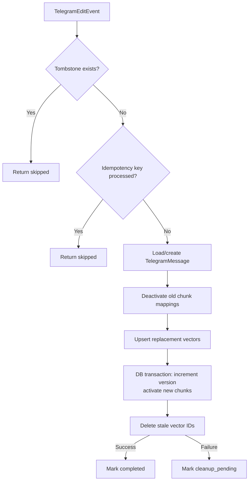

# Nexora Telegram Edit Synchronization

## Decision Record DR-3: Edit Replacement Strategy

**Chosen:** Strategy C — Replacement upsert then immediate stale deletion.

**Why:** Deterministic vector IDs mean re-running the edit produces the same
vector IDs. ChromaDB's `upsert()` overwrites existing IDs, so replacement is
safe. If stale deletion fails, it is recorded as `cleanup_pending` and retried
by the reconciliation service.

**Tradeoff:** Brief window where both old and new chunk IDs coexist if edit
produces different chunk counts. Reconciliation closes this within one cycle.

## Decision Record DR-4: Unknown-Message Edit Policy

**Chosen:** Upsert-if-reconstructible. If the edit event contains enough fields
to construct a full message record, it is ingested with `is_edited=True` and
`current_version=1`. Otherwise, the operation is marked FAILED with
reason `unknown_message_unreconstructible`.

## Edit Flow



## Idempotency Key Format

```
telegram:edit:{account_id}:{chat_id}:{message_id}:{update_id_or_timestamp}
```
