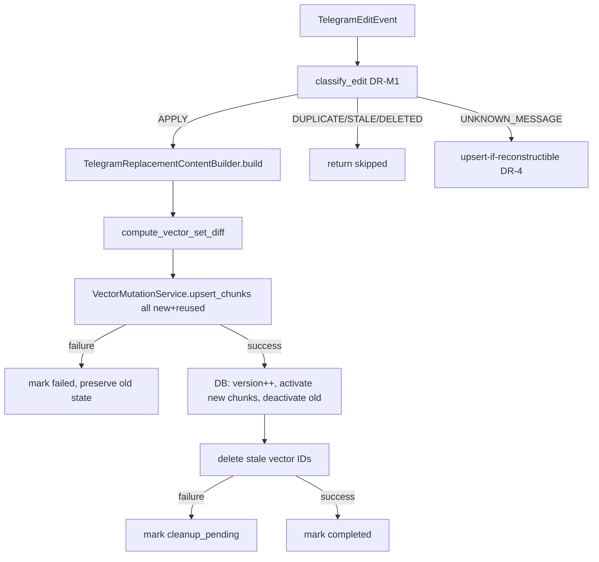

# Nexora — Telegram Multi-Chunk Edit Handling

## Overview

All Telegram message edits — regardless of content type — are now handled with
full multi-chunk vector set diffing, failure-safe replacement (Strategy C),
and reconciliation repair.

## Decision Records

### DR-M1 — Edit Ordering Signal

**Chosen:** Primary: `edit_timestamp`. Tie-break: `update_id` string comparison.
**Why:** Telegram's `edit_date` is reliable for most edits. `update_id` resolves
rapid re-edits at the same timestamp.
**Rollback:** Change `classify_edit()` tie-break; no schema change.

### DR-M2 — Version NOT in Vector ID

**Chosen:** `message_version` stored in vector metadata only. Vector ID is stable:
`telegram:{account}:{conv}:{msg}:{content_part}:{chunk_index}`
**Why:** Stable IDs enable upsert-in-place for reused chunks, the core efficiency
of Strategy C.
**Rollback:** No schema change; metadata field is additive.

### DR-M3 — Strategy C confirmed for multi-chunk

**Chosen:** Upsert replacement vectors → commit DB version → delete stale vectors.
**Why:** Scales naturally to N chunks via set-difference computation.
Cited from prior milestone DR-3.

### DR-M4 — Caption-only reuse criteria

**Chosen:** Reuse when both `checksum` AND `telegram_file_id` are unchanged.
**Why:** file_id alone not sufficient (Telegram can reassign). Checksum alone not
sufficient (hash collision possible). Both together provide high confidence.
**If checksum matches but file_id differs:** re-process (different file).
**If no checksum:** re-process (can't confirm identity).

## Vector Set Computation

```
old_ids = active chunks before edit
new_ids = replacement chunks from builder

reused   = old ∩ new   → upsert in-place (same content_part:chunk_index)
new_only = new − old   → insert fresh
stale    = old − new   → delete after commit
```

## Edit Flow



## Content-Type Chunk Counts

| Type    | Chunks | ID Format |
|---|---|---|
| text, link | 1 | `text:0` |
| pdf | N pages | `pdf:0..N-1` |
| docx | N sections | `docx:0..N-1` |
| pptx | N slides | `pptx:0..N-1` |
| image | 1 | `image:0` |
| voice | N segments | `voice:0..N-1` |
| video | N segments | `video:0..N-1` |

## Failure States

| Failure | Result | Recovery |
|---|---|---|
| Upsert fails | `status=failed`, old state preserved | Retry event |
| Stale deletion fails | `status=cleanup_pending`, new version active | Reconciliation |
| Partial write | `reconciliation_required=True` | Reconciliation |

## Phase-0 Snapshot (text-edit non-regression)

Pre-generalization text edit contract:
- Vector ID: `telegram:{acc}:{conv}:{msg}:text:0`
- Version: prev + 1
- replacement_vector_count: 1
- status: "ok" or "cleanup_pending"

**Post-generalization: identical behavior confirmed by TestTextEditNonRegression.**
