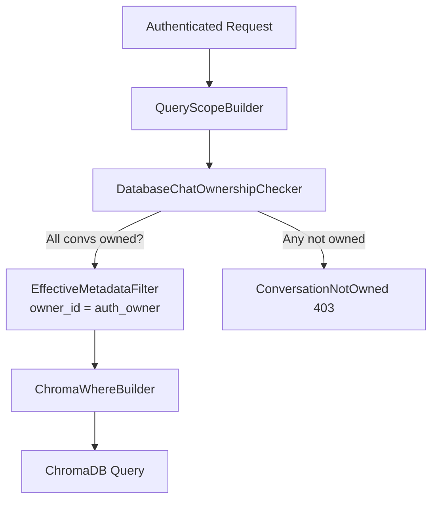

# Nexora Telegram Ownership

## Decision Record DR-1: Disabled-Chat Searchability

**Chosen:** `indexing_enabled=False` controls future ingestion only.
Already-indexed data remains searchable unless explicitly deleted via
`DELETE /integrations/telegram/chats/{id}/data`.

**Why:** Users disabling indexing expect to stop capturing new messages, not
to lose their existing knowledge base.

**How to change:** Add `is_searchable: bool` to `TelegramChatORM` and
filter on it in `DatabaseChatOwnershipChecker`.

## Decision Record DR-2: Sender Membership Validation

**Chosen:** Sender membership in groups is NOT validated against a DB
membership table. `sender_id` filtering is a ChromaDB metadata filter only.

**Why:** No live Telegram data is available in the mock stage. Building a
membership store would require live event processing.

**Future interface:** `ISenderMembershipChecker` protocol in
`ownership_checker.py`. Replace `_UnvalidatedSenderChecker` when live data
is available.

## DatabaseChatOwnershipChecker

Replaces `_AlwaysOwnedChecker`. A chat is queryable when:
1. `chat.owner_id == authenticated_owner_id`
2. `chat.is_deleted == False`
3. (Implicitly) chat exists in `tg_chats`

`indexing_enabled` is NOT checked here (DR-1).

## Owner Isolation Flow

## Security: Frontend Cannot Override Owner

`QueryScopeBuilder.build(authenticated_owner_id, requested_filters)` always
sets `effective.owner_id = authenticated_owner_id`, regardless of any
`owner_id` value in `requested_filters`. Client-supplied owner_id is silently
overridden — never passed to ChromaDB.
